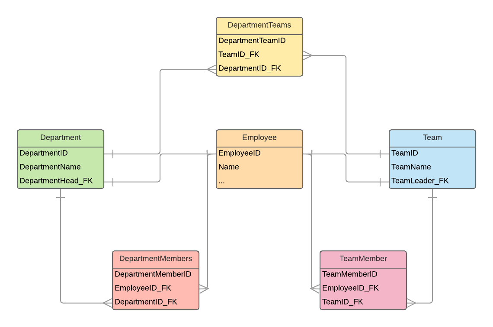

# Проект по учету сотрудников компании

## Использованные технологии:
- Python
- Django 
- Django REST API
- JWT-авторизация

## Сам себе создал задачу из "yandex.ru". Просто задача понравилась

##  Схема базы данных. Сам нашел
  
  
## Команда загрузки тестовых данных
`` python manage.py load_test_data``